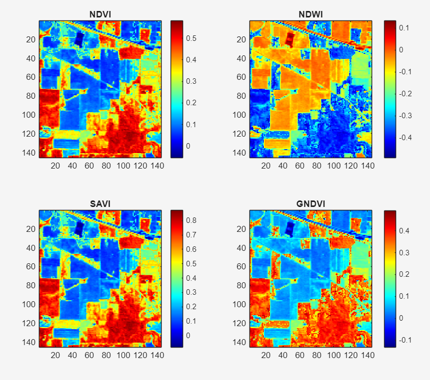
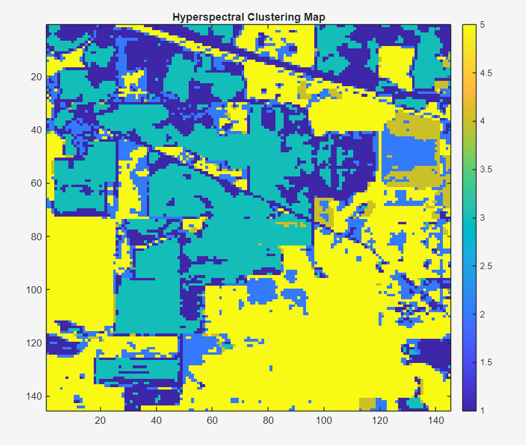
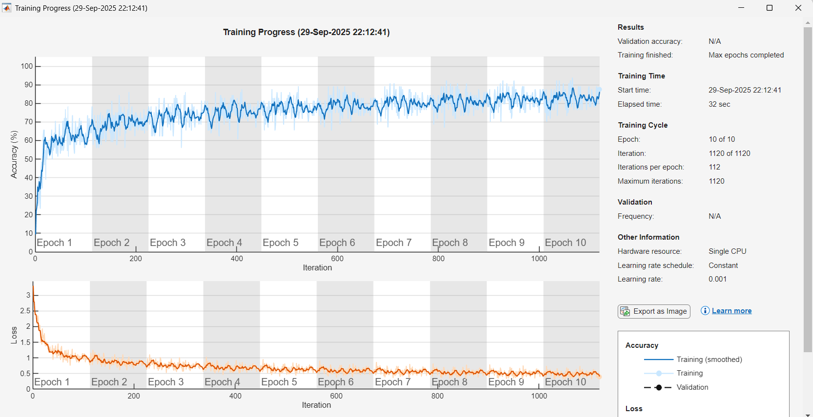

# 🌱 Krishi Mitra – AI-powered Crop Monitoring

**Smart India Hackathon 2025**  
**Team Vanquish | Team ID: 80928**  
**Problem Statement ID: 25099**  
**Theme: Agriculture, FoodTech & Rural Development**  
**Category: Software**  

---

## 🚜 Problem Statement
Farmers lack proper systems to detect diseases, nutrient deficiencies, or stress factors early.  
Existing methods are **manual, slow, and inefficient**, reducing yield and profit.

---

## 💡 Proposed Solution
**Krishi Mitra** leverages **AI + IoT + Hyperspectral Imaging** for real-time monitoring of crops.  

- Early detection of crop stress, diseases & pests  
- Soil health insights (moisture, pH, nutrients)  
- Pest outbreak predictions using AI + weather data  
- Personalized farmer advisory (app + voice support)  

---

## 🔬 Technical Approach
- **Imaging**: Multispectral/Hyperspectral Cameras (Drone/Satellite)  
- **IoT & Hardware**: DHT11, DHT22, ESP32 sensors  
- **Cloud & Backend**: AWS, Express, WhatsApp API  
- **Database**: MongoDB  
- **Frontend**: React + Farmer App/Dashboard  
- **AI/ML**: Stress & disease detection, soil/pest prediction  
- **Data Processing**: MATLAB (Image Processing, Hyperspectral Analysis, Deep Learning)  

---

## 🌈 Hyperspectral Indices

| Index | Focus | Use Case | Image |
|-------|-------|----------|-------|
| **NDVI & SAVI** | Disease detection, pest control, crop health | General crop monitoring |  |
| **NDVI & NDWI** | Irrigation & crop health | Irrigation needs, drought stress |  |
| **NDSI** | Soil health | Distinguishing bright surfaces (snow, sand, dry soil) from vegetation |  |

---

## 🌍 Innovation & Uniqueness
- Hyperspectral imaging beyond human vision  
- Region-specific AI models for **local crops & pests**  
- Hybrid monitoring: **Drones + Ground Sensors + Satellite**  
- Voice-based advisory in **local languages**  

---

## ⚙️ Features
- ✅ Early detection of crop stress & disease  
- ✅ Real-time soil health monitoring  
- ✅ AI-powered pest outbreak predictions  
- ✅ Farmer-friendly mobile/web app with maps & advisory  
- ✅ Works even in **offline mode + SMS/voice advisory**  

---

## 📊 Benefits
**Economic**: Optimized input usage → higher profit  
**Social**: Improved yields → food security & reduced farmer stress  
**Environmental**: Reduced chemical use → sustainable farming  

---

## 🚀 Installation & Usage
```bash
# Clone the repo
git clone https://github.com/Anurag-535/Krishi_Mitra.git

# Navigate to project
cd Krishi_Mitra

# Install dependencies
npm install

# Start frontend
npm run dev

# Backend setup
cd backend
npm install
npm start
